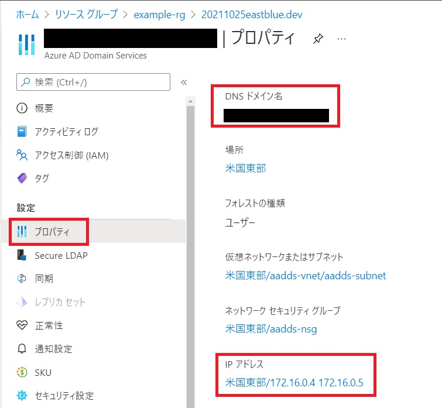
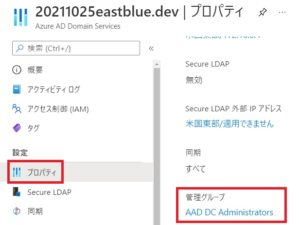

# AADD
Create Azure Active Directory Domain Service by Terraform (Azure RM 2.46)

## 背景
下記が通常のサンプル

https://registry.terraform.io/modules/schnerring/aadds/azurerm/latest

上記のサンプル内の「source  = "schnerring/aadds/azurerm"」では下記を参照しており、AzureRM v2.69.0が指定されている。

https://github.com/schnerring/terraform-azurerm-aadds

そのため、AzureRM v2.69.0 以下を利用している場合、下記の事象になるためTerraformからARM Templateを呼び出す必要がある。

https://github.com/hashicorp/terraform-provider-azurerm/issues/8970

## セットアップ（Linux）
terraform install

https://learn.hashicorp.com/tutorials/terraform/install-cli

Azure CLI install

https://docs.microsoft.com/ja-jp/cli/azure/install-azure-cli-linux?pivots=apt

Azureへのログイン

    $ az login

tfstateファイルをAzure Storageに格納する。

https://docs.microsoft.com/ja-jp/azure/developer/terraform/store-state-in-azure-storage?tabs=azure-cli

管理グループの作成
    $ az provider register --namespace 'Microsoft.AAD'
    $ az ad sp create --id 6ba9a5d4-8456-4118-b521-9c5ca10cdf84
    $ az ad group create --display-name 'AAD DC Administrators' --mail-nickname AADDCAdministrators

## リソース作成
    $ terraform plan
    $ terraform apply
    
## リソース作成後
DNSのIPアドレス確認


## ユーザーの作成
管理グループからユーザーを作成


## ドメイン参加（Ubuntu）
1. hostsファイルの編集

    $ sudo vi /etc/hosts
    ```
    127.0.0.1 hostname.ドメイン名   hostname
    ```
    <br>

2. 必要なパッケージのインストール

    $ sudo apt-get update

    $ sudo apt-get install krb5-user samba sssd sssd-tools libnss-sss libpam-sss ntp ntpdate realmd adcli
    <br><br>

3. ネットワーク タイム プロトコル (NTP) の構成
    
    $ sudo vi /etc/ntp.conf
    ```
    server ドメイン名
    ```
    $ sudo systemctl stop ntp

    $ sudo ntpdate ドメイン名

    $ sudo systemctl start ntp
    <br><br>

4. マネージド ドメインを検出

    $ sudo realm discover ドメイン名
    <br><br>

5. Kerberos を初期化

    $ kinit -V ユーザー名@ドメイン名
    <br><br>

6. VM をマネージド ドメインに参加

    $ sudo vi /etc/krb5.conf
    下記を追記
    ```
    rdns=false
    ```

    $ sudo realm join --verbose ドメイン名 -U 'ユーザー名@ドメイン名' --install=/
    <br><br>

7. ログイン確認
    $ ssh -l ユーザー名@ドメイン名 VMのIP
    <br><br>

参考URL

https://docs.microsoft.com/ja-jp/azure/active-directory-domain-services/template-create-instance

VMのドメイン参加手順
https://docs.microsoft.com/ja-jp/azure/active-directory-domain-services/join-ubuntu-linux-vm